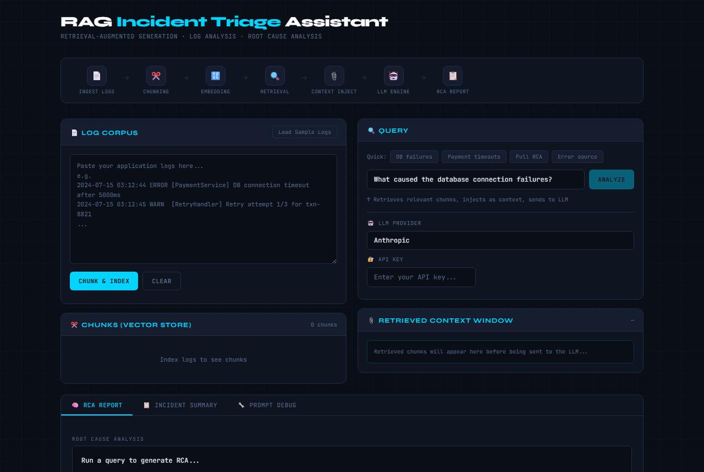
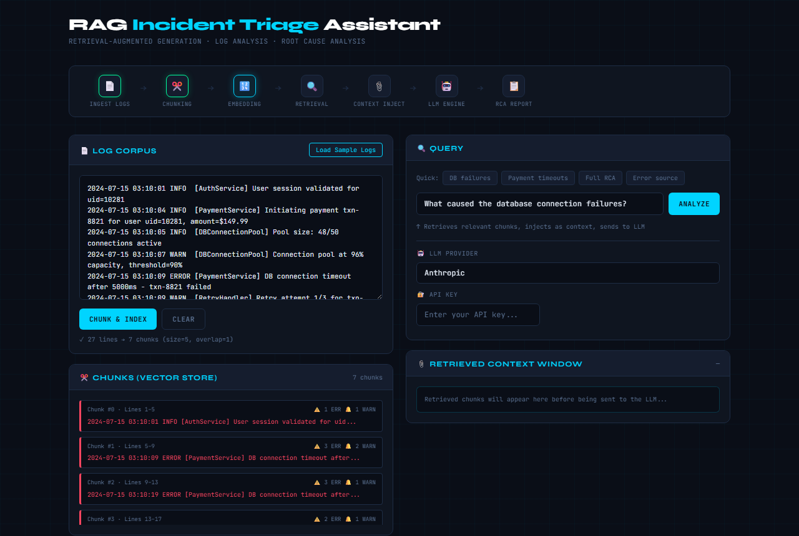
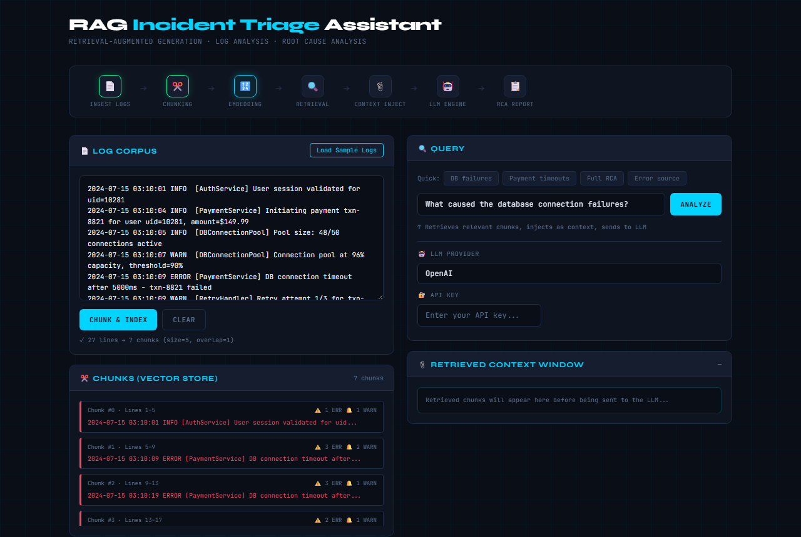
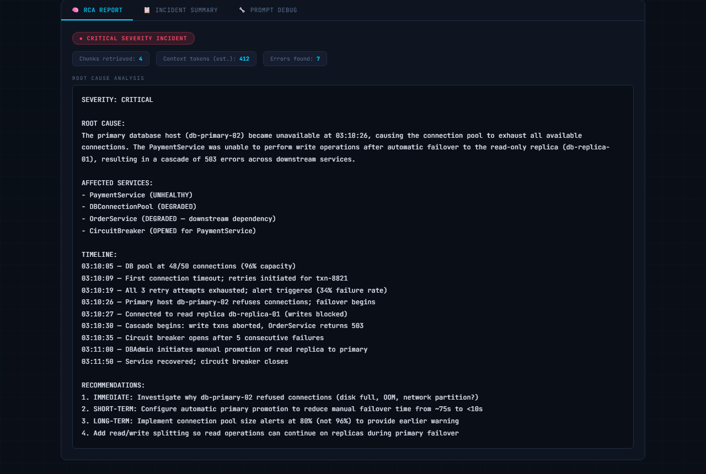
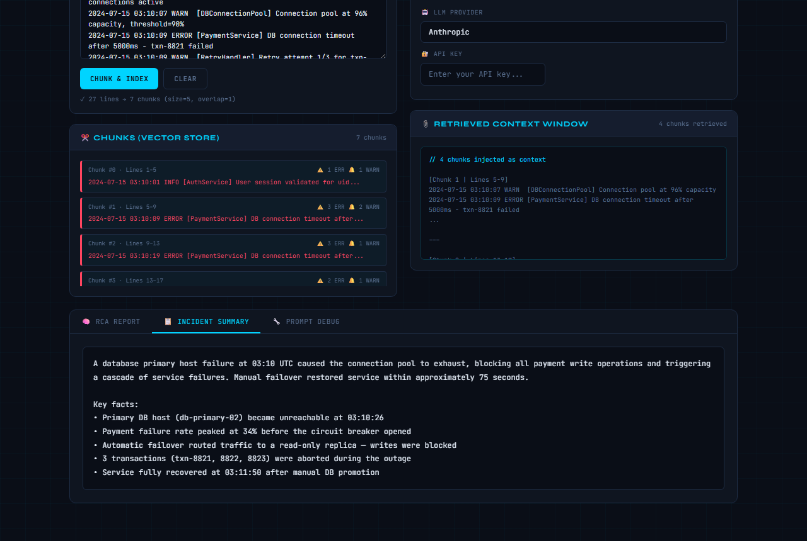
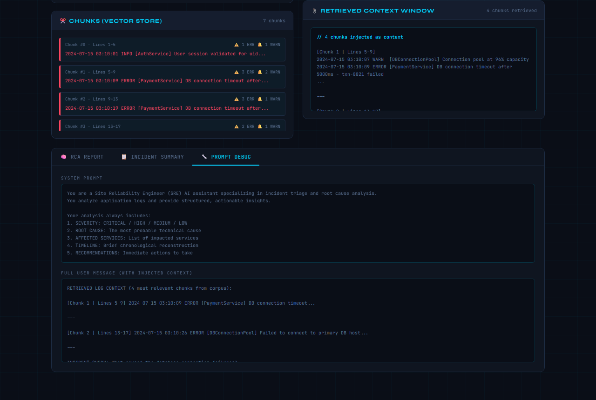

# RAG Incident Triage Assistant

> **A beginner-friendly guide — no prior AI or programming knowledge required.**

---

## 🤔 What Is This Tool?

Imagine you are an engineer and your app just crashed at 3 AM. You have hundreds of lines of error logs but no idea where to start. This tool reads those logs, finds the important parts, and uses an AI to tell you **exactly what went wrong and how to fix it** — in plain English.

It is called a **RAG** tool. RAG stands for **Retrieval-Augmented Generation**. Here is what that means in simple terms:

| Step | Plain English Explanation |
|------|--------------------------|
| **Retrieval** | The tool searches through your logs to find the most relevant lines |
| **Augmented** | It adds those relevant lines to the question being sent to AI |
| **Generation** | The AI reads the context and generates a human-readable answer |

Think of it like giving a doctor (the AI) only the most relevant test results (your logs) before asking for a diagnosis.

---

## 🖼️ Screenshots

### 1. Main Dashboard

> The pipeline at the top lights up as each step runs — from ingesting logs all the way to the final report.

### 2. Sample Logs Loaded & Chunked

> After clicking **"Chunk & Index"**, logs are split into small searchable pieces shown on the right.

### 3. Provider & API Key Setup

> Choose your AI provider from the dropdown and paste your API key.

### 4. Analysis Running

> The tool returns a severity badge (CRITICAL / HIGH / MEDIUM / LOW) and a full root cause analysis.

### 5. Incident Summary Tab

> The **Incident Summary** tab gives a short, plain-English summary — perfect for quickly briefing your team.

### 6. Prompt Debug Tab

> The **Prompt Debug** tab shows exactly what was sent to the AI — great for learning how RAG works.

---

## 📁 Project File Structure

```
rag_incident_triage/
│
├── index.html      ← The main web page (open this in your browser)
├── styles.css      ← All the colors, fonts, and layout
├── script.js       ← The core logic: chunking, retrieval, and AI calls
├── api-key.js      ← Handles API key input and provider switching
├── config.js       ← Settings: providers, models, prompts
└── README.md       ← This file
```

**You do not need to install anything.** Just a browser and an API key.

---

## 🚀 Quick Start (5 Minutes)

### Step 1 — Get the Code

**Option A: Download as ZIP** *(easiest for beginners)*
1. Go to the GitHub repository page
2. Click the green **"Code"** button
3. Click **"Download ZIP"**
4. Extract the ZIP to any folder on your computer (e.g. `Desktop/rag_incident_triage`)

**Option B: Clone with Git** *(if you have Git installed)*

Open a terminal (on Windows: press `Win + R`, type `cmd`, press Enter) and run:

```bash
git clone https://github.com/YOUR_USERNAME/rag_incident_triage.git
cd rag_incident_triage
```

> **Don't have Git?** Download it from [git-scm.com](https://git-scm.com) — it is free and takes 2 minutes to install.

---

### Step 2 — Get an API Key

The tool needs an AI provider to generate the analysis. Pick **one** of these (all have free tiers to get started):

| Provider | Best For | Free Tier | Get API Key |
|----------|----------|-----------|-------------|
| **Groq** ⭐ Recommended for beginners | Fast & free | ✅ Yes | [console.groq.com/keys](https://console.groq.com/keys) |
| **Anthropic** | Most accurate | Limited free | [console.anthropic.com](https://console.anthropic.com) |
| **OpenAI** | Most popular | Paid only | [platform.openai.com/api-keys](https://platform.openai.com/api-keys) |
| **Mistral AI** | European, privacy-focused | ✅ Yes | [console.mistral.ai](https://console.mistral.ai/api-keys/) |

**How to get a Groq key (recommended — free, fast, no credit card):**
1. Go to [console.groq.com](https://console.groq.com)
2. Sign up with your Google or GitHub account
3. Click **"API Keys"** in the left menu
4. Click **"Create API Key"**
5. Copy the key — it starts with `gsk_...`

---

### Step 3 — Open the App

1. Open the folder where you saved/cloned the project
2. Double-click **`index.html`**
3. It will open in your web browser — that's the whole setup!

> The app runs entirely in your browser. No server, no installation, no terminal needed.

---

### Step 4 — Run Your First Analysis

Follow these steps in order inside the app:

#### ① Load Sample Logs
Click the **"Load Sample Logs"** button (top-right of the Log Corpus panel).

This loads a realistic example of a payment service database failure — a common real-world incident.

#### ② Chunk the Logs
Click the **"Chunk & Index"** button.

You will see the logs get split into small labeled segments on the right side panel. These are called **chunks** — the tool will search through them to find what's relevant to your question.

#### ③ Select Your Provider
In the **Query panel**, scroll down to **🤖 LLM Provider**.

Select your AI provider from the dropdown (e.g. **Groq** if you followed the recommendation above).

#### ④ Enter Your API Key
Paste your API key into the **🔐 API Key** field.

Click the 👁️ icon to check it was pasted correctly, then click it again to hide it.

#### ⑤ Ask a Question
The query input already has a default question:
> *"What caused the database connection failures?"*

You can use it as-is, or choose a quick preset question:
- **DB failures** — Database-related issues
- **Payment timeouts** — Transaction failures
- **Full RCA** — Complete root cause analysis of everything
- **Error source** — Which service is most broken

#### ⑥ Click Analyze
Click the **"Analyze"** button.

Watch the pipeline at the top light up as each step runs. In 5–15 seconds you will get:

- A **severity badge** (CRITICAL / HIGH / MEDIUM / LOW)
- A detailed **Root Cause Analysis** with timeline and recommendations
- A short **Incident Summary** for your team
- A **Prompt Debug** view showing exactly what the AI received

---

## 🔍 Understanding the Pipeline

The pipeline bar at the top shows what is happening step by step:

```
📄 Ingest Logs → ✂️ Chunking → 🔢 Embedding → 🔍 Retrieval → 📎 Context Inject → 🤖 LLM Engine → 📋 RCA Report
```

| Step | What it does |
|------|-------------|
| **📄 Ingest Logs** | Reads all the raw log text you pasted in |
| **✂️ Chunking** | Splits logs into 5-line segments (with 1-line overlap so nothing is missed at the edges) |
| **🔢 Embedding** | Prepares the chunks for searching (indexes them) |
| **🔍 Retrieval** | Scores every chunk against your question and picks the top 4 most relevant |
| **📎 Context Inject** | Puts those 4 chunks into the AI prompt |
| **🤖 LLM Engine** | Sends everything to the AI and waits for a response |
| **📋 RCA Report** | Displays the analysis in the output tabs below |

---

## 🌐 Supported AI Providers

| Provider | Model Used | Format | Notes |
|----------|-----------|--------|-------|
| **Anthropic** | claude-sonnet-4-20250514 | Anthropic native | Best quality |
| **OpenAI** | gpt-4o | OpenAI | Most widely known |
| **Groq** | llama-3.3-70b-versatile | OpenAI-compatible | Fastest, free tier |
| **Mistral AI** | mistral-large-latest | OpenAI-compatible | European data privacy |
| **Custom** | Your model | OpenAI-compatible | Any self-hosted / local LLM |

### Using a Custom / Local LLM
If you are running a local model with [Ollama](https://ollama.com) or [LM Studio](https://lmstudio.ai):

1. Select **"Custom / Self-hosted"** from the provider dropdown
2. Enter your **Base URL**, e.g. `http://localhost:11434/v1` (Ollama) or `http://localhost:1234/v1` (LM Studio)
3. Enter the **Model name**, e.g. `llama3` or `mistral`
4. API key can be anything (e.g. `local`) — local models usually ignore it

---

## 📋 Using Your Own Logs

Instead of the sample logs, you can paste your own. Supported log formats include:

**Standard timestamped logs:**
```
2024-07-15 03:12:44 ERROR [ServiceName] Something went wrong
2024-07-15 03:12:45 WARN  [ServiceName] Retrying...
```

**Docker / Kubernetes logs:**
```
{"timestamp":"2024-07-15T03:12:44Z","level":"error","msg":"DB timeout","service":"api"}
```

**Nginx / Apache access logs, Python tracebacks, Node.js console output** — all work fine.

> **Tip:** The more logs you paste, the better the retrieval. The tool handles thousands of lines.

---

## 💡 Tips for Best Results

- **Ask specific questions** — "Why did the database stop accepting connections at 03:10?" gets better results than "What happened?"
- **Use the Full RCA preset** for a complete overview when you don't know where to start
- **Check the Prompt Debug tab** — it shows exactly which log lines were sent to the AI, so you can understand why it gave a certain answer
- **Red-highlighted chunks** in the Vector Store panel are error chunks — the tool automatically boosts their relevance score
- **Cyan-highlighted chunks** are the ones that were actually retrieved and sent to the AI for your query

---

## 🔐 Security & Privacy

| Question | Answer |
|----------|--------|
| Is my API key stored anywhere? | No. It lives only in your browser tab's memory and is gone when you close the tab. |
| Are my logs sent anywhere? | Only to the AI provider you selected (e.g. Groq, OpenAI). They are not stored by this tool. |
| Does this tool have a backend server? | No. It is 100% client-side HTML/CSS/JavaScript. |
| Can I use it offline? | Partially — the UI works offline, but AI calls need an internet connection. For offline AI, use a local model (Ollama). |

---

## 🛠️ Editing the Code

The code is split into clear files. Here is where to go for common changes:

| What you want to change | Which file | What to edit |
|-------------------------|-----------|-------------|
| Add a new AI provider | `config.js` | Add a new entry to the `PROVIDERS` object |
| Change chunk size (default: 5 lines) | `config.js` | `CHUNK_CONFIG.CHUNK_SIZE` |
| Change number of retrieved chunks | `config.js` | `CHUNK_CONFIG.RETRIEVAL_TOP_K` |
| Change the RCA prompt | `config.js` | `SYSTEM_PROMPTS.RCA` |
| Change colors / fonts | `styles.css` | The `:root` CSS variables at the top |
| Add a new query preset button | `index.html` | Copy a `<button class="preset-btn">` in the Query panel |

---

## ❓ Frequently Asked Questions

**Q: I clicked Analyze but nothing happened.**
→ Make sure you clicked **"Chunk & Index"** first. The Analyze button stays disabled until logs are indexed.

**Q: I get an error like "API request failed".**
→ Double-check your API key is correct. Also confirm you selected the right provider from the dropdown.

**Q: The Groq API key starts with `gsk_` — is that right?**
→ Yes, that is correct. Different providers use different prefixes (`sk-` for OpenAI, `gsk_` for Groq, etc.).

**Q: Can I use this for logs that are not in English?**
→ Yes — the AI models support multiple languages. Results may vary by language.

**Q: How long can my logs be?**
→ There is no hard limit on the input. The tool retrieves only the top 4 most relevant chunks (about 20 lines) which are sent to the AI, so performance does not degrade with large logs.

**Q: Do I need Node.js, Python, or any runtime?**
→ No. This is a plain HTML file. A modern browser (Chrome, Firefox, Edge, Safari) is all you need.

---

## 📂 Project Structure (For Developers)

```
rag_incident_triage/
│
├── index.html
│   └── All HTML structure: header, pipeline bar, panels, output tabs
│
├── styles.css
│   └── Dark theme, CSS variables, responsive grid, animations
│
├── config.js           (loaded first)
│   ├── PROVIDERS       — provider definitions (URL, model, auth format)
│   ├── API_CONFIG      — token limits, timeout
│   ├── CHUNK_CONFIG    — chunk size and retrieval count
│   ├── SYSTEM_PROMPTS  — RCA and summary prompts
│   ├── SEVERITY_LEVELS — critical/high/medium/low definitions
│   └── ERROR_MESSAGES  — user-facing error strings
│
├── api-key.js          (loaded second)
│   ├── ApiKeyManager.init()            — sets up UI on page load
│   ├── ApiKeyManager.getProviderConfig() — resolves active provider
│   ├── ApiKeyManager.getValidated()    — validates key before each call
│   └── ApiKeyManager.onProviderChange() — updates UI when provider changes
│
└── script.js           (loaded last)
    ├── loadPreset()    — fills textarea with sample logs
    ├── chunkLogs()     — splits lines into overlapping chunks
    ├── retrieve()      — scores chunks by keyword match + error boost
    ├── runRAG()        — orchestrates the full pipeline
    ├── buildRequest()  — formats request body for anthropic/openai format
    ├── extractText()   — parses response for either format
    └── clearAll()      — resets all UI state
```

Script load order in `index.html`: `config.js` → `api-key.js` → `script.js`

---

## 🤝 Contributing

1. Fork the repository on GitHub
2. Clone your fork:
   ```bash
   git clone https://github.com/YOUR_USERNAME/rag_incident_triage.git
   ```
3. Make your changes
4. Test by opening `index.html` in a browser
5. Commit and push:
   ```bash
   git add .
   git commit -m "Your change description"
   git push origin main
   ```
6. Open a Pull Request on GitHub

---

## 📄 License

MIT — free to use, modify, and distribute.

## 📁 Project Structure

```
rag_incident_triage/
├── index.html         # Main HTML structure and layout
├── styles.css         # All styling and UI components
├── script.js          # Core RAG pipeline logic
├── api-key.js         # API key management module
├── config.js          # Configuration constants
└── README.md          # This file
```

## 🗂️ File Organization

### `index.html`
Contains the HTML structure with:
- Header with branding
- Pipeline visualization diagram
- Two-column main grid layout
  - **Left side**: Log corpus input and chunked log display
  - **Right side**: Query input and retrieved context window
- Output tabs for RCA report, incident summary, and prompt debugging
- **Note**: Includes an API key input field (password type) for Anthropic

### `styles.css`
Complete styling including:
- **CSS Variables**: Theme colors, fonts, spacing
- **Layout Components**: 
  - Pipeline steps and animations
  - Grid-based two-column responsive layout
  - Panel containers
- **UI Elements**:
  - Buttons (primary, secondary)
  - Input fields (text, password, textarea)
  - Badges and chips
  - Severity indicators (Critical, High, Medium, Low)
  - Code/log display boxes
- **Animations**: Spinner loading animation, smooth transitions
- **Responsive**: Mobile-friendly breakpoints

### `api-key.js`
Dedicated API key management module with features:

**Core Functions**
- `getApiKey()` - Retrieve API key from input field
- `setApiKey(key)` - Set API key in input field
- `clearApiKey()` - Clear API key from memory
- `getValidated()` - Get API key with validation (throws on error)

**Validation & Security**
- `validate()` - Check if API key is valid (format, length, prefix)
- `getMaskedKey()` - Return obfuscated API key (first 8 + last 4 chars)
- `isSet()` - Check if API key is currently set

**Storage (Optional)**
- `saveToStorage()` - Persist API key to localStorage temporarily
- `loadFromStorage()` - Load API key from localStorage
- `clearFromStorage()` - Remove API key from localStorage
- **Note**: Storage is disabled by default for security

**UI Setup**
- `init()` - Initialize API key input listeners
- `setupPasswordToggle()` - Add show/hide password toggle button

### `script.js`
Core application logic with well-documented functions:

**State Management**
- `chunks` - Array of indexed log chunks
- `lastRetrieved` - Recently retrieved chunks
- `lastSystemPrompt` / `lastUserPrompt` - Prompt history for debugging

**Key Functions**

**Chunking & Indexing**
- `loadPreset()` - Load sample logs
- `chunkLogs()` - Split logs into 5-line chunks with 1-line overlap
- `renderChunks()` - Display chunks in UI

**Retrieval**
- `retrieve(query, topK)` - Keyword-based chunk retrieval (simulates vector DB)

**RAG Pipeline**
- `runRAG()` - Main orchestration function that:
  1. Validates query and chunks
  2. Validates API key using `ApiKeyManager`
  3. Retrieves relevant chunks
  4. Builds context window
  5. Calls LLM API for RCA
  6. Generates incident summary
  7. Displays results

**UI Helpers**
- `setOutput()` - Render text output with loading states
- `setQuery()` - Set query from preset buttons
- `switchTab()` - Tab switching logic
- `clearAll()` - Reset all data
- `activatePipe()` - Animate pipeline progress

### `config.js`
Centralized configuration constants:
- **API_CONFIG**: Base URL, model, max tokens, timeout
- **CHUNK_CONFIG**: Chunk size, overlap, retrieval count
- **SYSTEM_PROMPTS**: RCA and summary prompts
- **SEVERITY_LEVELS**: Critical, High, Medium, Low definitions
- **ERROR_MESSAGES**: User-facing error strings
- **UI_CONFIG**: Animation delays and display heights

## 🚀 Getting Started

1. **Open the application**:
   ```
   Open index.html in your browser
   ```

2. **Setup API Key**:
   - Get an API key from [console.anthropic.com](https://console.anthropic.com)
   - Paste it in the "🔐 Anthropic API Key" input field
   - Use the 👁️ button to toggle visibility
   - The field validates:
     - Minimum length (20+ characters)
     - Prefix check (must start with "sk-")

3. **Load sample logs**:
   - Click "Load Sample Logs" button

4. **Chunk the logs**:
   - Click "Chunk & Index" button
   - Logs are split into 5-line segments with overlap

5. **Run analysis**:
   - Select or type a query
   - Click "Analyze" button
   - System retrieves relevant chunks and sends to LLM

6. **View results**:
   - **RCA Report Tab**: Full root cause analysis with severity badge
   - **Incident Summary Tab**: Concise summary for on-call engineer
   - **Prompt Debug Tab**: See system prompt and full context sent to LLM

## 🔐 API Key Management

The `api-key.js` module provides:

**Features**
- ✅ Secure input field (password type)
- ✅ Client-side validation with helpful error messages
- ✅ Show/hide toggle button (👁️)
- ✅ Masked key display (`sk-abcdef...wxyz`)
- ✅ No automatic persistence (manual opt-in for storage)
- ✅ Validated on every API call

**Security Notes**
- API key is **never** sent to our servers or logged
- Stored only in browser memory (cleared on page refresh)
- Optional localStorage persistence (disabled by default)
- Validation performed client-side before API calls
- HTTPS strongly recommended for production

**Programmatic Usage**
```javascript
// Get API key
const key = ApiKeyManager.getApiKey();

// Validate and get (throws on error)
try {
  const validKey = ApiKeyManager.getValidated();
} catch (err) {
  console.error('Invalid key:', err.message);
}

// Check if set
if (ApiKeyManager.isSet()) {
  console.log('API key is configured');
}

// Clear from memory
ApiKeyManager.clearApiKey();

// Get masked version for display
const masked = ApiKeyManager.getMaskedKey();
console.log(`Using key: ${masked}`);
```

## 🔄 RAG Pipeline

```
Logs Input
    ↓
Chunking (5 lines, 1 overlap)
    ↓
Embedding (indexing for retrieval)
    ↓
Query → Retrieval (keyword matching on chunks)
    ↓
Context Assembly (injected into prompt)
    ↓
Advanced LLM Engine
    ↓
RCA Report + Summary
```

## 🎨 Colors & Theme

- **Accent** (Cyan): `#00d4ff` - Primary action color
- **Background**: `#0a0e17` - Dark navy
- **Surface**: `#0f1520` - Slightly lighter navy
- **Error/Critical**: `#ff4560` - Red
- **Warning**: `#ffcc00` - Yellow
- **Success**: `#00ff9d` - Green

Uses JetBrains Mono for code and Syne for display text.

## 🔧 API Integration

The app calls a large language model API endpoint at:
```
POST https://api.anthropic.com/v1/messages
```

**Required Headers**:
- `Content-Type: application/json`
- `x-api-key: YOUR_API_KEY`

## 📝 Notes

- Retrieval is keyword-based (simulates vector similarity)
- Chunks with errors are boosted in relevance scoring
- API key is stored only in memory (not persisted)
- All processing happens client-side except LLM calls
- Responsive design works on mobile devices

## 🔐 Security

- API key input is password-protected
- No sensitive data is logged to console in production
- API key is never stored to localStorage
- HTTPS recommended for production use
